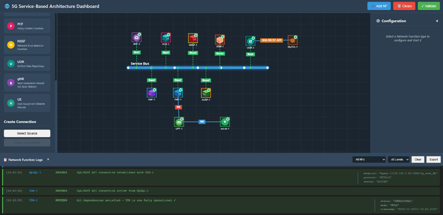
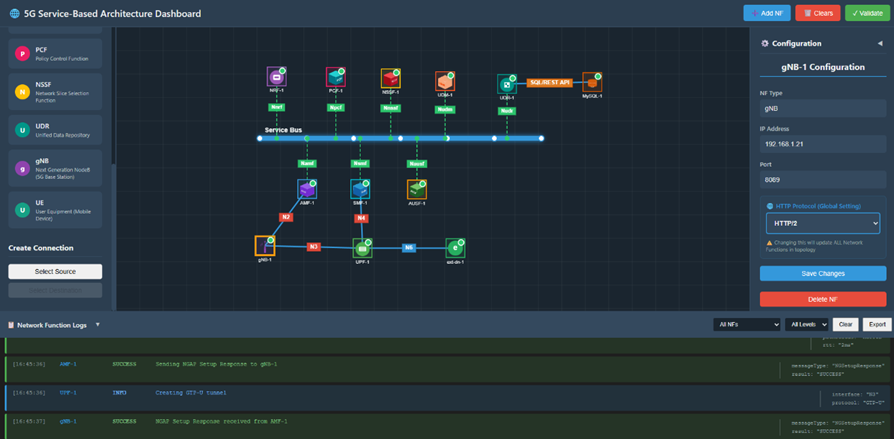
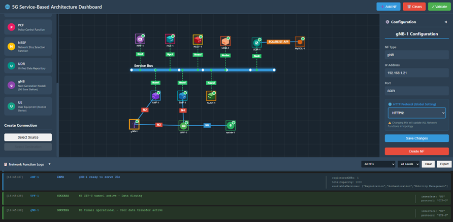

## Step 1: Initialize the Service-Based Architecture (SBA) Dashboard

### 1. Open the SBA Simulator Dashboard

Launch the SBA Simulator Dashboard. This is the main interface for visualizing and managing all 5G Core Network Functions (NFs).

### 2. Verify Dashboard Initialization

Once the dashboard loads, verify the following:

- **NF List Panel** – Displays all available NFs (left or top section).
- **Configuration Panel** – Allows configuring each NF upon selection (right side).
- **Logs Section** – Displays real-time NF logs (bottom section).
- **Command Terminal** – Available per NF for debugging commands such as `ping`.

Ensure:
- The UI is responsive.
- No errors appear during initialization.


*Figure 1: Service-Based Architecture (SBA) Dashboard*

---

## Step 2: Start a Network Function (NF)

### 1. Select an NF to Configure

From the NF List Panel, select the Network Function to deploy.

Common examples:

- **AMF** – Access and Mobility Management Function  
- **SMF** – Session Management Function  
- **UPF** – User Plane Function  
- **NRF** – Network Repository Function  

After selection, the Configuration Panel appears.


*Figure 2: NF Selection and Configuration Panel*

---

### 2. Enter NF Configuration Details

#### IP Address
Enter a valid IPv4 address:

```bash
192.168.1.10
```

#### Port Number
Enter a valid service port (e.g., `8080`, `9090`).

#### Protocol
Choose:
- HTTP/1  
- HTTP/2  

---

### 3. Start the NF

Click **Start NF** to launch the selected Network Function.

---

### 4. Wait for NF Stabilization

- Initialization typically takes **4–5 seconds**.
- The NF registers with the core network.
- The NF prepares to communicate with other NFs.


*Figure 3: NF Stabilization Process*

---

### 5. Verify NF Startup Logs

In the Logs Section, confirm:

- `NF started successfully`
- `Service registration complete`
- `NF ready to accept connections`

These indicate successful startup.

---

### 6. Repeat for All Core Network Functions

Start all required NFs:

- AMF  
- SMF  
- UPF  
- UDM  
- AUSF  
- NRF  
- PCF  
- Any additional required NFs  

Ensure each NF:
- Starts successfully  
- Stabilizes properly  
- Shows active status in logs  



*Figure 4: 5G Core Network Stabilization*

---

## Step 3: Configure and Start the gNB

### 1. Configure the gNB

Select the gNB tile from the NF panel and configure:

- IP Address  
- Port Number  
- Protocol (HTTP/2 recommended)

---

### 2. Start the gNB

Click **Start gNB**.

Within approximately **5 seconds**, it will:

- Establish NGAP signaling with the AMF  
- Create the GTP-U tunnel with the UPF  



*Figure 5: gNB Startup and NGAP*



*Figure 6: GTP-U Tunnels Active*

---

## Step 4: UE Configuration and Registration

### 1. Configure the UE

Enter the following in the UE Configuration Panel:

| Parameter | Example Value | Description |
|------------|---------------|-------------|
| IMSI | 001010000000101 | 15-digit subscriber identifier |
| Key (K) | fec86ba6eb707ed08905757b1bb44b8f | 128-bit authentication key |
| OPc | C42449363BBAD02B66D16BC975D77CC1 | Operator variant key |
| DNN | 5G-Lab | Data Network Name |
| NSSAI SST | 1 | Slice Type (1=eMBB, 2=URLLC, 3=MIoT) |


*Figure 7: UE Configuration Panel*

---

### 2. Match Subscriber Profile

Ensure the UE configuration matches the profile stored in the **UDR (Unified Data Repository)**.

This ensures successful authentication.

---

### 3. Start the UE

Click **Start UE**.

Within approximately **5 seconds**, the UE:

- Stabilizes
- Sends registration messages
- Initiates authentication

---

### 4. UE-to-Core Connection Sequence

The following sequence occurs:

- N1 connection established (UE ↔ AMF)
- NAS signaling activated
- Authentication and security handshake completed
- PDU session established
- UE receives IP address on `tun_0` (e.g., `192.168.100.2`)


*Figure 8: UE Registration and NAS Signaling*

---

## Step 5: Validate Connectivity

### 1. Test Network Path Using Ping

From the UE terminal:

```bash
ping 8.8.8.8
```

Expected result:

- Reply messages received  
- 0% packet loss  


*Figure 9: Successful Ping Test*

Example IP mappings:

- `192.168.1.11` – AMF  
- `192.168.1.13` – UPF  
- `192.168.1.16` – External Data Network  

---

### 2. Measure Throughput and RTT Using iPerf

#### Throughput Test

```bash
iperf3 -B <UE_ip> -c <ext-dn_ip>
```


*Figure 10: Throughput Test*

---

#### RTT Test

```bash
iperf3 -B <UE_ip> -c <ext-dn_ip> -R
```


*Figure 11: RTT Test*

---

## Final Verification

The 5G Core Network simulation is functioning correctly if:

- All NFs start successfully  
- gNB connects to AMF and UPF  
- UE registers successfully  
- UE receives an IP address  
- Ping shows 0% packet loss  
- iPerf shows measurable throughput  

---
