## Step 1: Initialize the Service-Based Architecture (SBA) Dashboard

### 1. Open the SBA Simulator Dashboard

Launch the SBA Simulator Dashboard. This is the main interface for visualizing and managing all 5G Core Network Functions (NFs).

### 2. Verify Dashboard Initialization

Once the dashboard loads, verify the following:

- **NF List Panel** – Displays all available NFs (left or top section).
- **Configuration Panel** – Allows configuring each NF upon selection (right side).
- **Logs Section** – Displays real-time NF logs (bottom section).
- **Command Terminal** – Available per NF for debugging commands such as `ping`.

Ensure:
- The UI is responsive.
- No errors appear during initialization.

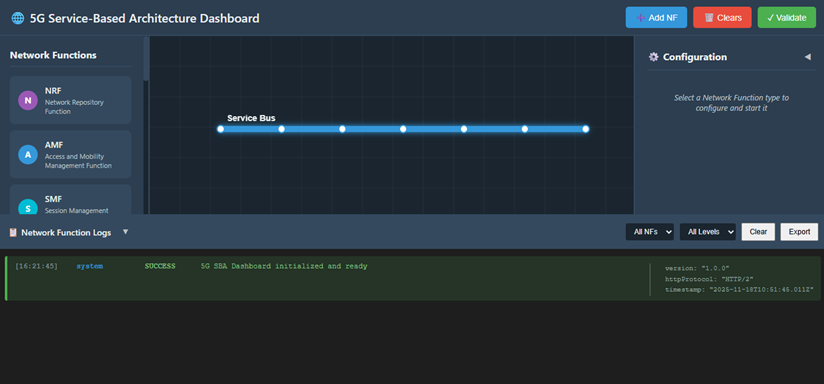

*Fig: Service-Based Architecture (SBA) Dashboard*

---

## Step 2: Deploy Core Network Using Terminal

This method allows you to deploy all Network Functions and gNB services using Docker Compose from the terminal. This is the fastest way to set up the entire 5G Core Network infrastructure.

---

### Step 2.1: Launch the Core Network

Click on the **Terminal** button to open the terminal, then from the project root directory, execute:

```bash
docker compose -f docker-compose.yml up -d
```

This is your one-shot command to bring the entire 5G core network to life. It reads the `docker-compose.yml` file and spins up all the Network Functions — AMF, SMF, UPF, NRF, and the rest — as Docker containers running quietly in the background. The `-d` flag (detached mode) means your terminal stays free while everything starts up behind the scenes. You won't see a wall of logs flooding your screen; instead, Docker just confirms each container is starting and hands control back to you.

**What this command does:**
- Reads the `docker-compose.yml` configuration file
- Creates and starts all containerized Network Functions
- Runs containers in **detached mode** (`-d` flag) so they run in the background
- Automatically establishes inter-NF communication


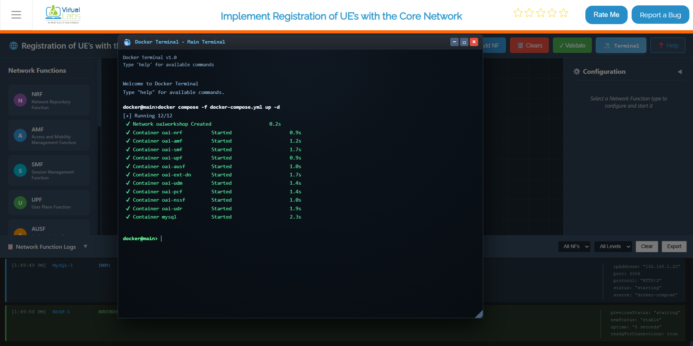

*Fig: Core Network Deployment*


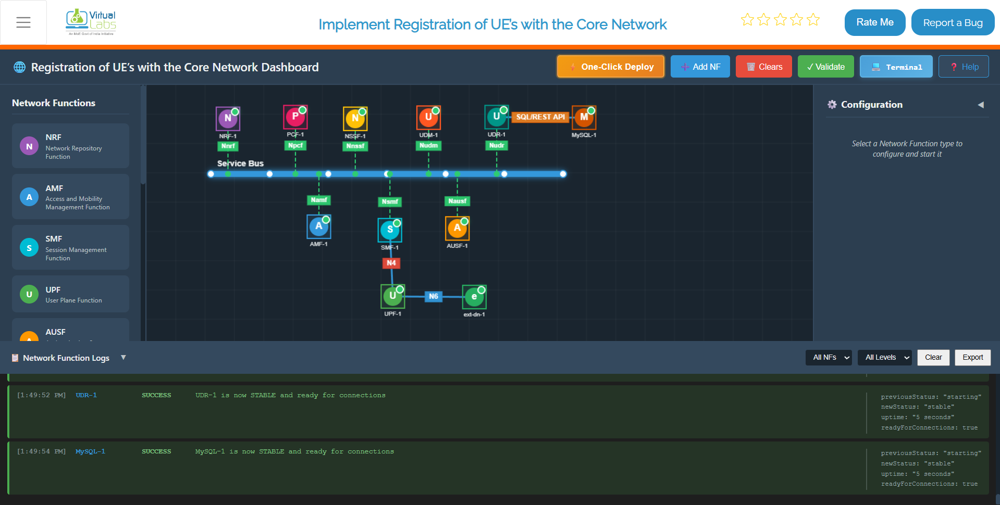

*Fig: Core Network Deployed*

---

### Step 2.2: Launch the gNB Services

Once the core network is up and running, deploy the gNB services:

```bash
docker compose -f docker-compose-gnb.yml up -d
```

Once the core is up, this command brings the gNB (next-generation NodeB) online. The gNB is your 5G base station — the bridge between the radio side and the core network. As soon as it starts, it reaches out to the AMF to register itself and sets up the GTP-U tunnel with the UPF for user data. Without this step, no UE can ever attach to the network.

**What this command does:**
- Deploys the gNB (base station) container
- Configures gNB networking parameters
- Establishes NGAP signaling connection with AMF
- Creates GTP-U tunnel with UPF
- Prepares the gNB for UE attachment

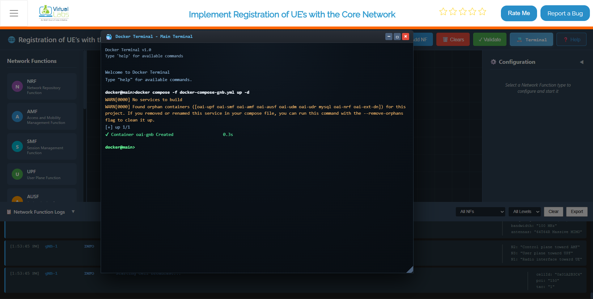

*Fig: gNB Deployment and Core Integration*


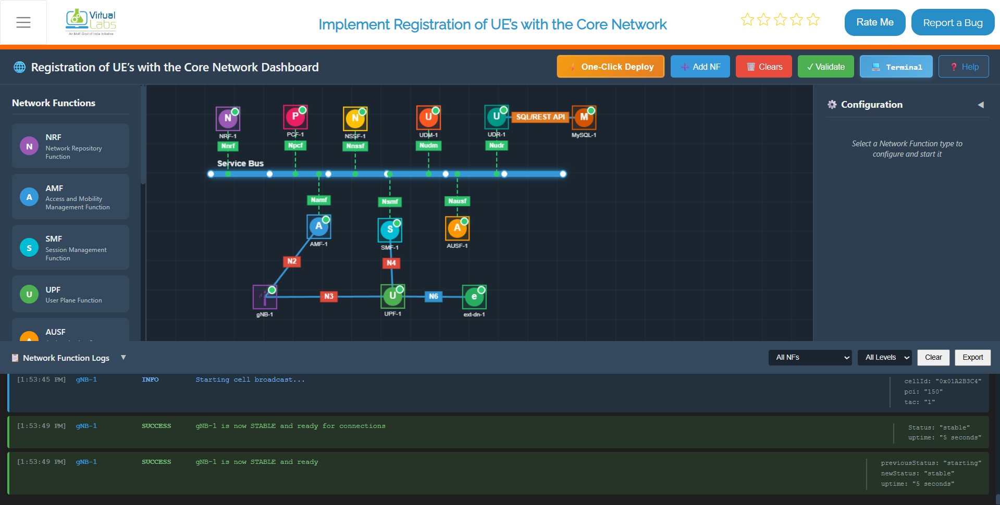

*Fig: gNB Deployed and Core Integrated*


---

### Step 2.3: Monitor Container Status

To continuously monitor the status of the core network containers, use:

```bash
watch docker compose -f docker-compose.yml ps -a
```

Think of this as your deployment health monitor. The `watch` command re-runs the `docker compose ps -a` every 2 seconds, giving you a live, auto-refreshing table of all containers and their current state. The `-a` flag is key here — it shows every container, including ones that may have exited or crashed, so nothing slips past you. Keep this running in a separate terminal right after deployment and watch everything settle into a healthy `running` state before moving on.

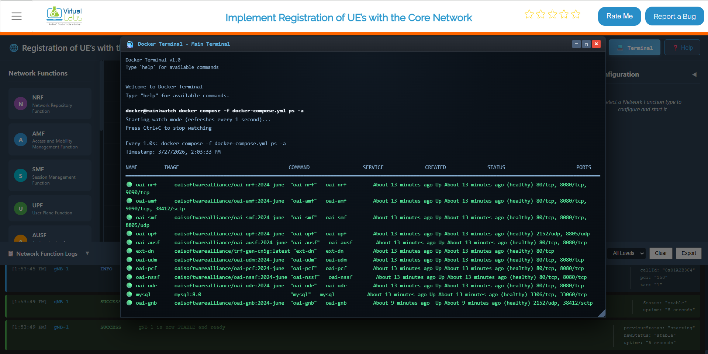

*Fig: Live container status monitoring with watch command*

### Step 2.4: Verify Network and IP Assignment (Optional)

To verify the Docker network and IP assignments:

```bash
docker network inspect oaiworkshop
```
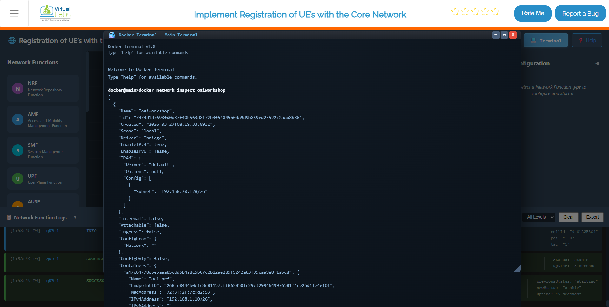

*Fig: Docker network inspection showing container IP assignments*

This is a quick sanity check after deployment. It shows you the full details of the `oaiworkshop` Docker network — which containers are connected, what IP addresses they've been assigned, and how the network is configured. If you ever need to verify that a specific NF got the right IP or that all containers are on the same network, this is the command to run.

---

### Step 2.6: Stop All Services

When you're done with testing or need to reset the environment:

```bash
docker compose -f docker-compose.yml down
```

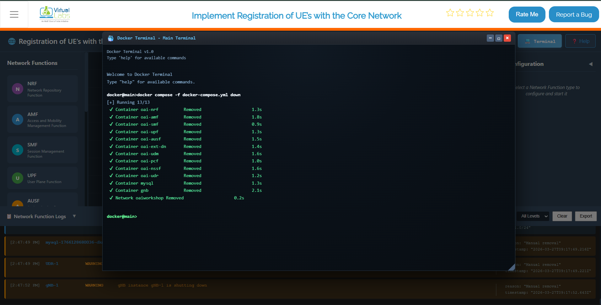

*Fig: Stopping all services and removing containers with docker compose down*

This command stops and removes all containers, networks, and associated resources.

---

## Step 3: Configure and Start Network Functions (NFs)

After deployment, configure individual Network Functions from the dashboard to establish proper service operation.

---

### Step 3.1: Select an NF to Configure

From the NF List on the dashboard, click on the NF you want to deploy.

Examples include:

- **AMF** (Access and Mobility Management Function)
- **SMF** (Session Management Function)
- **UPF** (User Plane Function)
- **NRF** (Network Repository Function)
- **AUSF** (Authentication Server Function)
- **UDM** (Unified Data Management)
- **PCF** (Policy Control Function)

Clicking an NF opens its Configuration Panel on the right.


*Fig: Select NF and Open Configuration Panel*

---

### Step 3.2: Enter NF Configuration Details

In the configuration panel, enter the required fields:

**IP Address:**
- Provide a valid IPv4 address (e.g., 192.168.1.10)
- This is the address the NF will bind to for service communication

**Port Number:**
- Set the port on which the NF will run (e.g., 8080, 9090, etc.)
- Each NF should have a unique port to avoid conflicts

**Protocol:**
- Select either **HTTP/1** or **HTTP/2** depending on the NF behavior
- Some NFs may auto-select based on internal configuration

| Parameter | Example | Description |
|-----------|---------|-------------|
| IP Address | 192.168.1.10 | IPv4 address for NF binding |
| Port Number | 8080 | Service listening port |
| Protocol | HTTP/2 | Communication protocol |

---

### Step 3.3: Start the NF

Click the **Start NF** button. The NF will begin starting up.

---

### Step 3.4: Wait for NF Stabilization

Once initiated:

- The NF takes around **4–5 seconds** to stabilize
- During this time, it registers itself and establishes basic service readiness
- The NF attempts to connect to other available NFs
- Once stabilized, it becomes fully operational


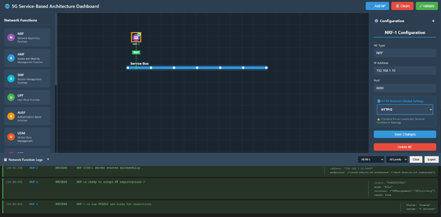

*Fig: NF Stabilizing Process*

---

### Step 3.5: Verify NF Startup Logs

Scroll down to the **Logs Section**:

Successful startup messages include:

-  `"NF started successfully"` – Process/container started without errors
-  `"Service registration complete"` – NF registered with NRF
-  `"NF ready to accept connections"` – NF is live and operational

Example log output:
```
[AMF] 2024-01-15 10:32:45 - NF started successfully
[AMF] 2024-01-15 10:32:47 - Connecting to NRF at 192.168.1.11:8000
[AMF] 2024-01-15 10:32:48 - Service registration complete
[AMF] 2024-01-15 10:32:49 - NF ready to accept connections
```

This indicates the function is live and communicating (if any peer NFs are up).

---

### Step 3.6: Repeat for All Remaining NFs

Follow the same steps (3.1–3.5) for each NF in the 5G Core:

1. **NRF** (Network Repository Function) – Deploy first
2. **UDM** (Unified Data Management) – Deploy second
3. **AUSF** (Authentication Server Function) – Deploy third
4. **SMF** (Session Management Function) – Deploy fourth
5. **UPF** (User Plane Function) – Deploy fifth
6. **AMF** (Access and Mobility Management Function) – Deploy sixth
7. **PCF** (Policy Control Function) – Deploy last (optional)

**For each NF, ensure:**

-  Starts correctly without errors
-  Stabilizes within 4–5 seconds
-  Appears in the logs as active
-  Shows successful service registration

Once all NFs are deployed, configured, and stabilized, your 5G core setup becomes fully active and interconnected, ready for gNB and UE attachment.

---

## Step 4: Start the gNB (Radio Access Node)

Once the core network is stabilized, configure and start the gNB (base station).

---

### Step 4.1: Select and Configure the gNB

From the NF List Panel on the dashboard:

1. Locate and click on the **gNB** tile
2. The gNB Configuration Panel appears on the right
3. Enter the following configuration details:

| Parameter | Example | Description |
|-----------|---------|-------------|
| IP Address | 192.168.1.20 | IPv4 address for gNB binding |
| Port Number | 2152 | SCTP/UDP listening port (GTP-U port) |
| PLMN ID | 20801 | Public Land Mobile Network ID |
| gNB ID | 1 | Unique base station identifier |

---

### Step 4.2: Click Start gNB

Click the **Start gNB** button to launch the radio access node.

---

### Step 4.3: Wait for gNB Stabilization

Within **5 seconds**, the gNB will become stable. During this initialization:

- The gNB starts up and initializes radio resources
- SCTP association is established with the core network
- Internal service readiness checks are performed
- The gNB becomes available for UE connections

---

### Step 4.4: Verify gNB Connections

The gNB will establish the following connections:

**1. NGAP Connection with AMF (N2 Interface)**
- Protocol: SCTP (Stream Control Transmission Protocol)
- Purpose: Access and Mobility Management
- Expected log: `"NGAP association established with AMF"`

**2. GTP-U Tunnel with UPF (N3 Interface)**
- Protocol: GTP-U (GPRS Tunneling Protocol – User Plane)
- Purpose: User data forwarding
- Expected log: `"GTP-U tunnel created with UPF at 192.168.1.13:2152"`

**3. Service Registration with NRF**
- All gNB services are registered in the Network Repository
- Expected log: `"gNB registered successfully in NRF"`

---

### Step 4.5: Verify gNB Logs

Scroll to the Logs Section and confirm these messages:

```
[gNB] 2024-01-15 10:35:00 - gNB started successfully
[gNB] 2024-01-15 10:35:02 - Initializing radio resources
[gNB] 2024-01-15 10:35:03 - SCTP association with core network established
[gNB] 2024-01-15 10:35:04 - NGAP association established with AMF
[gNB] 2024-01-15 10:35:05 - GTP-U tunnel created with UPF
[gNB] 2024-01-15 10:35:05 - gNB ready to accept UE connections
```

All messages indicate successful gNB startup and core integration.

---

## Step 5: UE Configuration and Registration

Once the gNB is up and connected to the core network, you can configure and register User Equipment (UE).

---

### Step 5.1: Configure the UE

From the dashboard, select the **UE** tile and enter the following in the UE Configuration Panel:

| Parameter | Example Value | Description |
|------------|---------------|-------------|
| IMSI | 001010000000101 | 15-digit subscriber identifier |
| Key (K) | fec86ba6eb707ed08905757b1bb44b8f | 128-bit authentication key |
| OPc | C42449363BBAD02B66D16BC975D77CC1 | Operator variant key |
| DNN | 5G-Lab | Data Network Name |
| NSSAI SST | 1 | Slice Type (1=eMBB, 2=URLLC, 3=MIoT) |


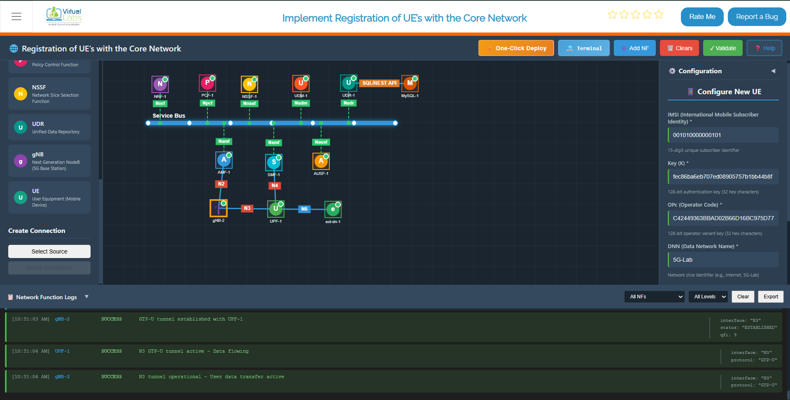

*Fig: UE Configuration Panel*

---

### Step 5.2: Match Subscriber Profile

Ensure the UE configuration matches the profile stored in the **UDR (Unified Data Repository)**.

This ensures successful authentication during the registration process.

---

### Step 5.3: Start the UE

Click **Start UE**.

Within approximately **5 seconds**, the UE:

- Stabilizes
- Sends registration messages to the core network
- Initiates authentication with the core

---

### Step 5.4: UE-to-Core Connection Sequence

The following sequence occurs after starting the UE:

- **N1 Connection Established** – UE ↔ AMF connectivity established
- **NAS Signaling Activated** – Non-Access Stratum messages exchanged
- **Authentication and Security Handshake Completed** – UE is authenticated
- **PDU Session Established** – Data path created from UE through UPF
- **IP Address Assignment** – UE receives IP address on `tun_0` (e.g., `192.168.100.2`)


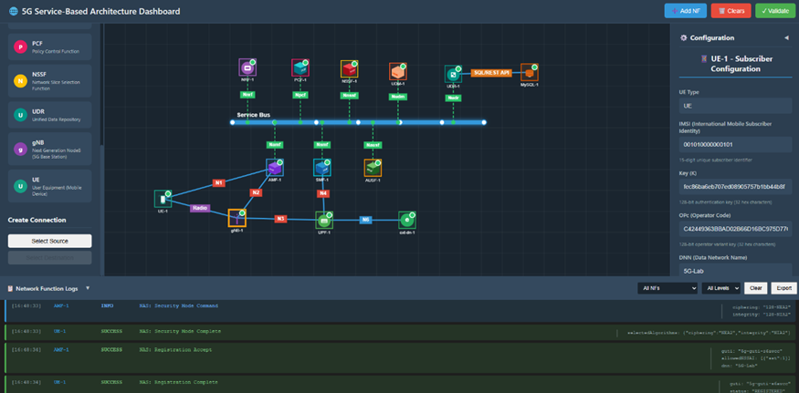

*Fig: UE Registration and NAS Signaling*

---

## Step 6: Validate Connectivity

Once the UE is registered and assigned an IP address, validate end-to-end connectivity through the 5G network.

---

### Step 6.1: Test Network Path Using Ping

From the UE terminal, test basic network connectivity:

```bash
ping 8.8.8.8
```

Expected result:

-  Reply messages received from the destination
-  0% packet loss indicating stable connectivity

Example successful ping output:
```
PING 8.8.8.8 (8.8.8.8) 56(84) bytes of data.
64 bytes from 8.8.8.8: icmp_seq=1 ttl=119 time=25.3 ms
64 bytes from 8.8.8.8: icmp_seq=2 ttl=119 time=24.8 ms
64 bytes from 8.8.8.8: icmp_seq=3 ttl=119 time=25.1 ms
--- 8.8.8.8 statistics ---
3 packets transmitted, 3 received, 0% packet loss, time 6ms
```


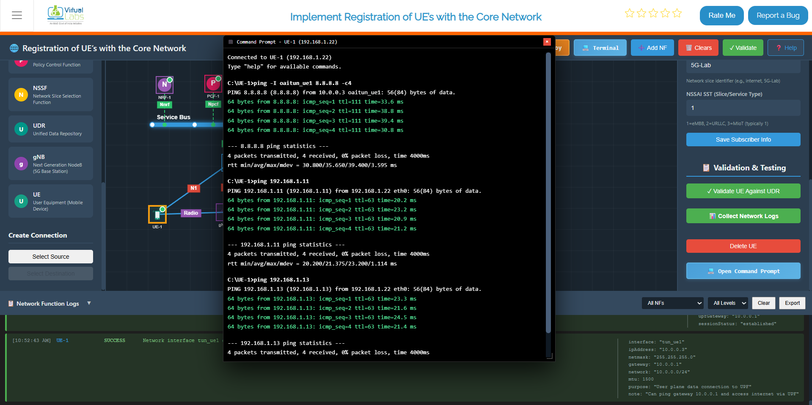

*Fig: Successful Ping Test Through 5G Core*

**Example IP Mappings in Your Environment:**

- `192.168.1.11` – AMF (Access and Mobility Management Function)
- `192.168.1.13` – UPF (User Plane Function)
- `192.168.1.16` – External Data Network (External DN)

---

### Step 6.2: Measure Throughput Using iPerf

To measure the throughput between the UE and external network, use **iPerf3**:

**Throughput Test:**

```bash
iperf3 -B <UE_ip> -c <ext-dn_ip>
```

Replace:
- `<UE_ip>` with the UE's assigned IP (e.g., `192.168.100.2`)
- `<ext-dn_ip>` with the external data network IP (e.g., `192.168.1.16`)

Example:
```bash
iperf3 -B 192.168.100.2 -c 192.168.1.16
```

Expected output shows:
- **Transfer amount** – Data transferred in MB/GB
- **Bandwidth** – Throughput in Mbps or Gbps
- **Jitter** – Variation in packet timing (lower is better)


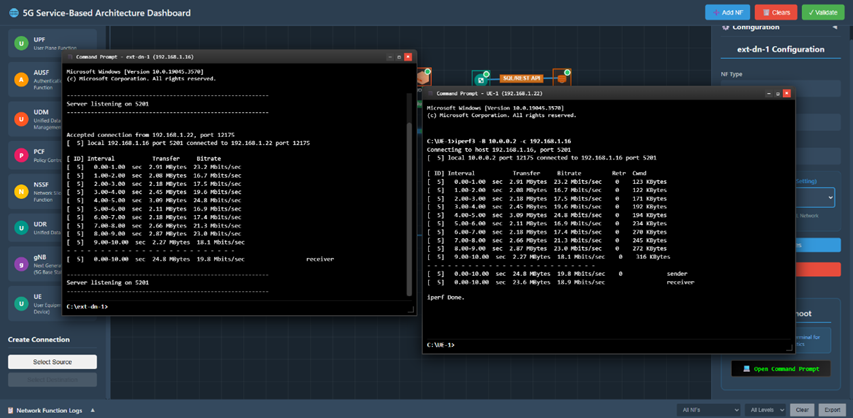

*Fig: Throughput Measurement with iPerf*

---

### Step 6.3: Measure Round-Trip Time (RTT) Using iPerf

To measure RTT (latency) in the reverse direction:

**RTT Test:**

```bash
iperf3 -B <UE_ip> -c <ext-dn_ip> -R
```

The `-R` flag reverses the test direction, measuring reverse throughput and RTT.

Example:
```bash
iperf3 -B 192.168.100.2 -c 192.168.1.16 -R
```

This measures the latency and throughput from the external network back to the UE through the 5G core network.


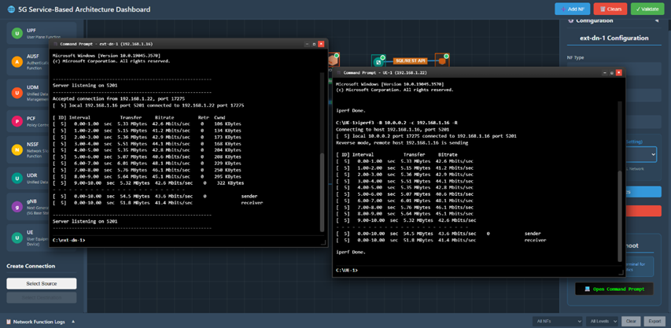

*Fig: RTT Measurement with iPerf*

---

### Step 6.4: Verify Connectivity Success Criteria

Your 5G Core Network simulation is functioning correctly if:

 **All NFs Start Successfully** – No errors during core network startup  
 **gNB Connects to AMF and UPF** – Base station registered with core network  
 **UE Registers Successfully** – User equipment attached to the network  
 **UE Receives an IP Address** – IP assigned on the TUN interface  
 **Ping Shows 0% Packet Loss** – Network path is stable  
 **iPerf Shows Measurable Throughput** – Data transmission is functional  

If all criteria are met, your 5G network is ready for further testing and validation.

---
