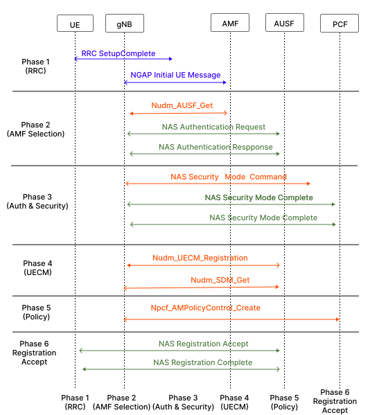
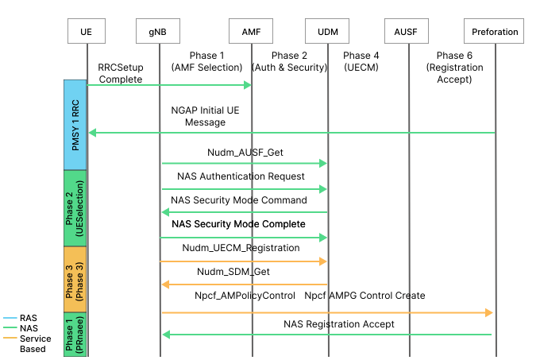
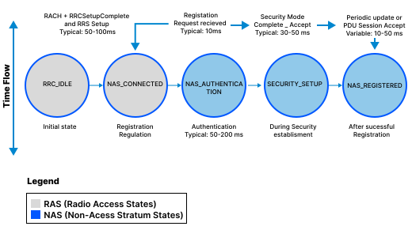
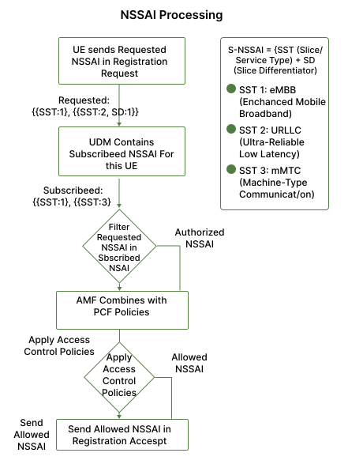
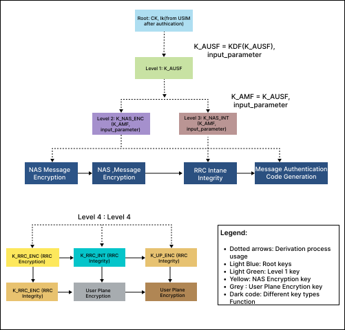
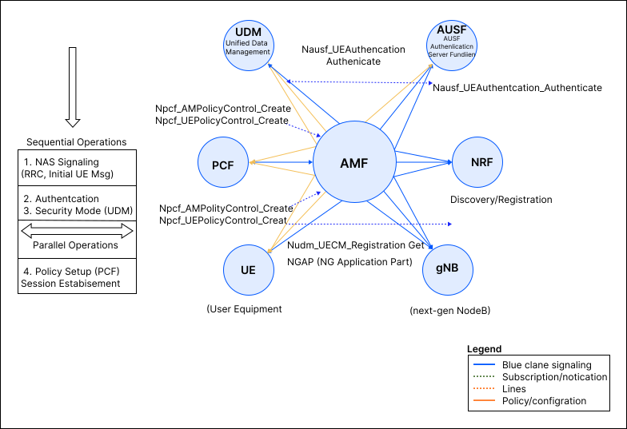

## 1. Introduction
The User Equipment (UE) registration procedure is one of the most fundamental processes in 5G Standalone (5G SA) networks. This document provides a detailed theoretical analysis of how a UE (such as a smartphone or IoT device) registers with the Access and Mobility Management Function (AMF) in a 5G Core Network. Understanding this process is critical for comprehending 5G network architecture, security mechanisms, and service delivery.

<strong>2. Fundamentals</strong>

## 2. Fundamentals

### 2.1 5G Network Architecture
The 5G Core Network (5GC) uses a service-oriented architecture (SOA) with multiple Network Functions (NFs) communicating via standardized APIs. The key entities involved in UE registration are:

* **UE (User Equipment)**: The end-user device initiating the registration request
* **gNB (Next Generation NodeB)**: The 5G radio access network base station responsible for radio resource management
* **AMF (Access and Mobility Management Function)**: Core network entity managing mobility, access control, and NAS signaling
* **UDM (Unified Data Management)**: Stores subscription information and authentication credentials
* **AUSF (Authentication Server Function)**: Handles authentication vectors and security procedures
* **PCF (Policy Control Function)**: Manages access and mobility policies
* **EIR (Equipment Identity Register)**: Validates device identity and checks for blacklisted equipment

### 2.2 Registration Types
The 5G specification (3GPP TS 24.501) defines multiple registration types:

* **Initial Registration**: First-time attachment of UE to 5G network
* **Mobility Registration Update**: Registration when UE moves to new AMF coverage area
* **Periodic Registration Update**: UE registers periodically as per timer-based policy
* **Emergency Registration**: Registration for emergency services access

This document focuses on Initial Registration as the primary use case.

### 2.3 NAS vs RAS Signaling
* **RAS (Radio Access Stratum)**: Signaling between UE and gNB (RRC protocol)
* **NAS (Non-Access Stratum)**: Signaling between UE and AMF, encapsulated inside RAS messages
* Registration requests and responses use NAS protocol messages defined in TS 24.501

<strong>3. UE Registration Process: Detailed Flow</strong>

## 3. UE Registration Process: Detailed Flow

*Fig: UE Registration Overall Message Sequence*

### 3.1 RRC Connection Establishment

#### 3.1.1 Initial Access
The registration process begins when the UE performs initial cell search and synchronization with the gNB:

* UE scans for 5G signals (NRSS - NR Synchronization Signals)
* UE detects and locks onto the gNB's reference signal
* UE obtains system information blocks (SIBs) containing RACH configuration

#### 3.1.2 RACH Procedure (Random Access Channel)
The UE initiates Random Access Channel (RACH) procedure:

* **Preamble Transmission**: UE sends preamble to gNB to request connection
* **RA Response**: gNB assigns uplink resources for UE to send RRC Setup Request
* **RRC Setup**: UE sends RRC Setup Request message including registration cause ("MO Signaling" or "MO Data")

#### 3.1.3 RRC Setup Complete
* gNB allocates RAN UE NGAP ID (unique identifier for this UE session)
* UE sends RRCSetupComplete message containing the NAS Registration Request message
* This marks the end of RAS establishment and beginning of NAS signaling

### 3.2 AMF Selection and Initial Context Setup

#### 3.2.1 gNB Selects AMF
The gNB performs AMF selection based on:

* Supported network slices (NSSAI - Network Slice Selection Assistance Information) requested by UE
* AMF capabilities advertised during gNB-AMF N2 connection setup
* Load balancing policies and availability
* Last known AMF (if UE has previous registration)

#### 3.2.2 Initial UE Message (gNB → AMF)
The gNB sends NGAP Initial UE Message containing:

* **RAN UE NGAP ID**: Unique identifier allocated by gNB
* **NAS PDU**: The Registration Request message from UE
* **User Location Information**: UE's location (TA - Tracking Area, cell ID)
* **RRC Establishment Cause**: Indicates why connection was established
* **UE Context Request**: Optionally requests retrieval from old AMF (in mobility scenarios)

#### 3.2.3 Registration Request Message (UE → AMF)
The NAS Registration Request includes:

* **SUCI (Subscription Concealed User Identity)** or **5G-GUTI (Globally Unique Temporary Identity)**: User identity (SUCI preferred for privacy)
* **Registration Type**: Initial, Mobility, or Periodic
* **Last Visited TAI (Tracking Area Identity)**: Previous tracking area (if applicable)
* **Requested NSSAI**: Network slices the UE wants to access
* **PDU Session Status**: Active PDU sessions if any
* **UE Security Capabilities**: Supported security algorithms and protocols
* **Device Properties**: IMEISV (device identity)

### 3.3 Authentication and Security Setup

#### 3.3.1 Identity Request (if SUCI not provided)
If AMF cannot identify the UE from provided identity:

* AMF sends NAS Identity Request requesting SUCI
* UE responds with NAS Identity Response containing SUCI
* This step is conditional based on UE identity provision

#### 3.3.2 AUSF Interaction and Authentication

**Step 1: UDM Authentication Information Request**
* AMF requests authentication vectors from UDM via AUSF
* Authentication vector contains: RAND (random challenge), AUTN (authentication token), XRES* (expected response)

**Step 2: NAS Authentication Request (AMF → UE)**
* AMF sends NAS Authentication Request containing:
  * RAND (128-bit random number)
  * AUTN (128-bit authentication token for network authentication to UE)
* UE verifies AUTN to authenticate the network (mutual authentication)
* UE computes authentication response: RES* = f4(RAND, Security Key K)

**Step 3: NAS Authentication Response (UE → AMF)**
* UE sends NAS Authentication Response containing RES*
* AMF verifies RES* against XRES*
* If verification successful, UE is authenticated
* If verification fails, authentication is rejected and UE is rejected

#### 3.3.3 Security Mode Setup

*Fig: Authentication and Security Mode Setup Detail*

After successful authentication, security is established:

**Step 1: NAS Security Mode Command (AMF → UE)**
* AMF sends NAS Security Mode Command selecting security algorithms:
  * NAS encryption algorithm (e.g., 128-EEA2, 128-EEA3)
  * NAS integrity protection algorithm (e.g., 128-EIA2, 128-EIA3)
  * RRC ciphering and integrity protection algorithms (for radio link)
* UE security capabilities are compared with network capabilities to ensure compatibility

**Step 2: NAS Security Mode Complete (UE → AMF)**
* UE responds with NAS Security Mode Complete message
* Message is now protected with selected algorithms
* All subsequent NAS messages are encrypted and integrity protected

**Step 3: EIR Check (Optional)**
* AMF sends IMEISV (device serial number) to EIR for device validation
* EIR checks if device is blacklisted or whitelisted
* Result returned to AMF

### 3.4 Phase 4: UECM Registration and Subscription Data Retrieval

#### 3.4.1 UE Context Management (UECM) Registration
AMF registers with UDM using Nudm_UECM_Registration:

* AMF sends registration message indicating it is the serving AMF for this UE
* UDM stores the AMF identity associated with this access type (3GPP, non-3GPP, etc.)
* UDM subscribes to deregistration events from this AMF
* This step ensures that only one AMF is serving the UE at any given time for a specific access type

#### 3.4.2 Subscription Data Management (SDM) - GET
AMF retrieves UE subscription data:

* Nudm_SDM_Get operation retrieves:
  * NSSAI (Network Slice Selection Assistance Information) authorized for this UE
  * Access and Roaming Restriction Rules
  * Slice-specific subscription parameters
  * User Consent and Privacy settings
  * Operator Policies

#### 3.4.3 Subscription Data Management (SDM) - Subscribe
AMF subscribes to SDM events:

* AMF subscribes using Nudm_SDM_Subscribe to be notified of:
  * Changes in UE's subscription data
  * Changes in network slice subscriptions
  * Updates to policies affecting the UE
* UDM will notify AMF whenever these parameters change

### 3.5 Phase 5: Policy Control and Access Management

#### 3.5.1 AM Policy Association (AMF-PCF Interaction)
AMF establishes policy association with PCF:

* AMF uses Npcf_AMPolicyControl_Create to create policy association
* PCF provides:
  * Access control policies (which slices/services allowed)
  * Mobility policies (handover thresholds, RAI - Registration Area Information)
  * QoS policies
  * Charging policies

#### 3.5.2 Allowed NSSAI Determination
* Combined from UE-Requested NSSAI and subscribed NSSAI, AMF determines Allowed NSSAI
* Only slices that are both requested AND subscribed are included
* This filtered set is sent to UE in Registration Accept message

### 3.6 Phase 6: Registration Accept and Completion

#### 3.6.1 NAS Registration Accept (AMF → UE)
AMF sends NAS Registration Accept message containing:

* **5G-GUTI (5G Globally Unique Temporary Identity)**: Temporary identity assigned by AMF for future use
* **Allowed NSSAI**: List of network slices UE is authorized to use
* **TAI List (Tracking Area Identity List)**: List of TAs where UE is registered (registration area)
* **GPRS Timer 3**: Periodic registration update timer value
* **SMS over NAS Support**: Indicator if SMS over NAS is supported
* **Access Type**: 3GPP or non-3GPP access

#### 3.6.2 RRC Reconfiguration
* gNB receives the updated parameters and sends RRCReconfiguration to UE
* UE acknowledges with RRCReconfigurationComplete

#### 3.6.3 NAS Registration Complete (UE → AMF)
* UE sends NAS Registration Complete message to acknowledge successful registration
* UE stores received 5G-GUTI for future use
* UE stores TAI List and registration area information
* This marks the successful completion of initial registration

### 3.7 Phase 7: Post-Registration - UE Policy Association (Optional)

#### 3.7.1 UE Policy Association
After successful registration, AMF can establish UE policy association:

* AMF uses Npcf_UEPolicyControl_Create with PCF
* PCF provides UE policies (device management, service enablement)
* These policies are sent to UE via UE Configuration Update message

#### 3.7.2 UE Ready for Data Services
After registration completion:

* UE can establish PDU sessions to access data services
* UE can send and receive SMS over NAS
* Mobility procedures (handovers, Tracking Area Updates) are now available
* UE is ready for full 5G service consumption

<strong>4. Key Concepts and Technical Details</strong>

## 4. Key Concepts and Technical Details

### 4.1 SUCI Encryption and Protection
The SUCI (Subscription Concealed User Identity) protects user privacy:

* UE's permanent identity (IMSI) is concealed using public key encryption
* Public key of the network obtained from public key distribution center
* SUCI format: NAI (Network Access Identifier) encrypted with operator's public key
* AUSF can decrypt SUCI to obtain SUPI (Subscription Permanent User Identity)

### 4.2 Temporary Identity Handling
* **5G-GUTI**: Temporary identity allocated by AMF for future registrations
* UE uses 5G-GUTI in subsequent registration attempts instead of SUCI
* Provides privacy improvement by rotating UE identity periodically
* Old 5G-GUTI remains valid until new one is accepted by UE

 
*Fig: UE Registration State Transitions*

### 4.3 Registration Area (TA List)
* AMF assigns a Tracking Area Identity (TAI) List (also called RA - Registration Area)
* UE can move within this area without sending registration update messages
* When UE moves outside TA List, it must perform Mobility Registration Update
* Reduces signaling overhead and improves mobility efficiency

### 4.4 Network Slicing in Registration
* UE can request specific network slices via Requested NSSAI (1 to 8 slices)
* Each NSSAI contains: S-NSSAI (Single-NSSAI) = {SST (Slice/Service Type) + SD (Slice Differentiator)}
* AMF filters requested NSSAI against subscribed NSSAI to determine Allowed NSSAI
* Different slices may have different:
  * QoS characteristics
  * Allowed services
  * PDU session types (IPv4, IPv6, Ethernet)
  * Charging models

*Fig: Network Slice Selection (NSSAI) Processing Flow*

### 4.5 Security Context Derivation
After authentication:

* **NAS key (K_NAS)**: Derived from shared secret using key derivation function
* **RRC keys (K_RRC enc, K_RRC int)**: Derived from K_NAS for radio link protection
* K_NAS = KDF(Authentication Key, Server Function Name)
* Separate keys for encryption and integrity protection ensure security separation

*Fig: Security Context and Key Derivation Tree*

### 4.6 Ciphering and Integrity Protection
* **NAS Ciphering**: All NAS signaling messages encrypted after security mode setup
* **NAS Integrity**: All NAS messages receive message authentication code (MAC) for integrity
* **RRC Ciphering**: RRC messages on radio link encrypted
* **RRC Integrity**: RRC messages integrity protected
* Together ensure confidentiality and authenticity of signaling

<strong>5. Message Sequence Summary</strong>

## 5. Message Sequence Summary

Below is the sequence of key messages in UE registration:

| Step | Message | Direction |
|------|---------|-----------|
| 1 | RRCSetupComplete (with Registration Request) | UE → gNB → AMF |
| 2 | Identity Request | AMF → UE |
| 3 | Identity Response | UE → AMF |
| 4 | NAS Authentication Request | AMF → UE |
| 5 | NAS Authentication Response | UE → AMF |
| 6 | NAS Security Mode Command | AMF → UE |
| 7 | NAS Security Mode Complete | UE → AMF |
| 8 | Registration Accept | AMF → UE |
| 9 | RRCReconfiguration (from gNB) | gNB → UE |
| 10 | Registration Complete | UE → AMF |

Table: Key NAS and RRC Messages in UE Registration

<strong>6. Network Function Interactions</strong>

## 6. Network Function Interactions

### 6.1 AMF-UDM Interaction
The AMF and UDM interact multiple times during registration:

| Operation | API | Purpose |
|-----------|-----|---------|
| Authentication Get | Nudm_AUSF_Get | Retrieve authentication vectors |
| UECM Registration | Nudm_UECM_Registration | Register AMF as serving function |
| SDM GET | Nudm_SDM_Get | Retrieve subscription data |
| SDM Subscribe | Nudm_SDM_Subscribe | Subscribe to data changes |
| AM Policy Control | Npcf_AMPolicyControl_Create | Create policy for UE |

Table: AMF Service Consumer Operations

### 6.2 Authentication via AUSF
AUSF acts as authentication server:

* Communicates with UDM to retrieve authentication credentials
* Generates authentication vectors (RAND, AUTN, XRES*)
* Returns vectors to AMF
* Validates RES* received from UE

### 6.3 Policy Control via PCF
PCF controls access and mobility:

* Creates policy association when AMF requests
* Provides access control and mobility policies
* Handles QoS policies and charging information
* Notifies AMF of policy changes

*Fig: AMF Network Function Interactions and APIs*

<strong>7. Conclusion</strong>

## 7. Conclusion

The UE registration process in 5G networks is a comprehensive multi-phase procedure that establishes secure connectivity, authenticates users, retrieves subscription information, and applies network policies. This document has detailed:

1. The complete flow from RRC setup through NAS registration completion
2. Security mechanisms including authentication, encryption, and integrity protection
3. Network function interactions demonstrating distributed processing
4. Policy control and network slicing considerations
5. Key concepts essential for understanding 5G registration

Together, these sections form a comprehensive resource for implementing, testing, and optimizing UE registration in 5G networks.

